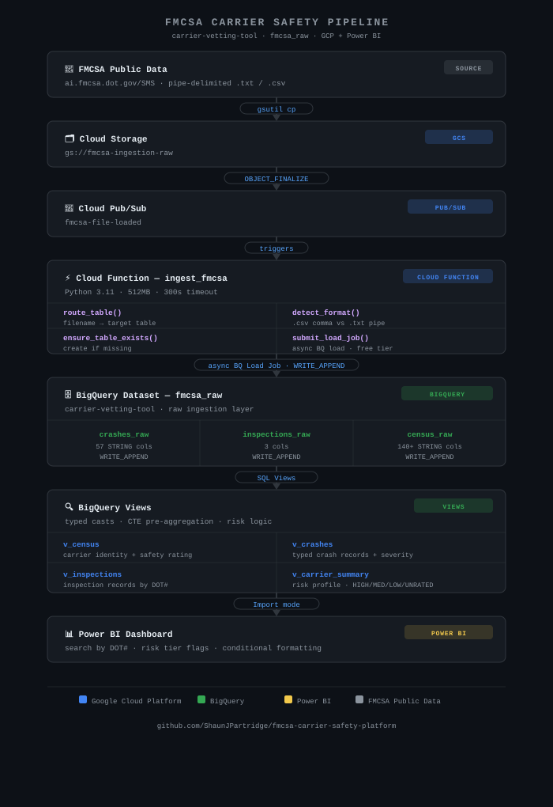
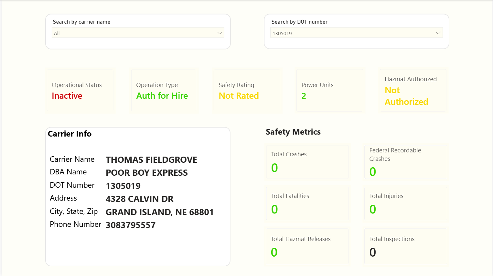

# Carrier Safety Vetting Platform

An event-driven data pipeline that automates FMCSA carrier safety compliance checks — replacing manual spreadsheet vetting with a structured BigQuery warehouse and live Power BI dashboard.

## Architecture



## Dashboard Preview



## Why Load Jobs (not Streaming Inserts)

The function uses BigQuery Load Jobs instead of `insert_rows_json`:

- **Free** — load jobs have no per-row cost; streaming inserts do
- **No size limits** — streaming inserts cap at 10MB/request and 50K rows/request, which breaks on large FMCSA files
- **Async** — the function kicks off the job and returns immediately; BigQuery handles the rest
- **Idempotent** — `WRITE_APPEND` + explicit schemas prevents partial load issues
- **Handles messy data** — `max_bad_records=1000` and `ignore_unknown_values=True` absorb FMCSA format quirks

## File Routing Logic

The single Cloud Function routes files by filename pattern:

| Filename contains | Target table |
|---|---|
| `crash` | `crashes_raw` |
| `inspection` | `inspections_raw` |
| anything else | `census_raw` |

Files ending in `.csv` are treated as comma-delimited; all others (`.txt`) as pipe-delimited (`|`).

## GCP Resources

| Resource | Name |
|---|---|
| GCP Project | `carrier-vetting-tool` |
| BigQuery Dataset | `fmcsa_raw` |
| GCS Bucket | `fmcsa-ingestion-raw` |
| Pub/Sub Topic | `fmcsa-file-loaded` |
| Cloud Function | `ingest_fmcsa` |

## Project Structure

```
carrier-safety-vetting/
├── cloud_function/
│   ├── main.py              ← single function, handles all three file types
│   └── requirements.txt
├── bigquery/
│   └── views/
│       ├── v_census.sql
│       ├── v_crashes.sql
│       ├── v_inspections.sql
│       └── v_carrier_summary.sql
├── infra/
│   └── setup.sh             ← one-shot GCP deploy script
└── README.md
```

## Setup

### Prerequisites
- GCP project with billing enabled
- APIs enabled: Cloud Functions, Pub/Sub, BigQuery, Cloud Storage
- `gcloud` CLI authenticated

### Deploy

```bash
bash infra/setup.sh
```

Or manually:

```bash
# 1. Create GCS bucket
gsutil mb gs://fmcsa-ingestion-raw

# 2. Create Pub/Sub topic and GCS notification
gcloud pubsub topics create fmcsa-file-loaded
gsutil notification create \
  -t fmcsa-file-loaded \
  -f json \
  -e OBJECT_FINALIZE \
  gs://fmcsa-ingestion-raw

# 3. Create BigQuery dataset
bq mk --dataset --location=US carrier-vetting-tool:fmcsa_raw

# 4. Deploy Cloud Function
gcloud functions deploy ingest_fmcsa \
  --runtime python311 \
  --trigger-topic fmcsa-file-loaded \
  --entry-point ingest_fmcsa \
  --source cloud_function/ \
  --region us-central1 \
  --timeout 300s \
  --memory 512MB

# 5. Create BigQuery views (run in order)
bq query --use_legacy_sql=false < bigquery/views/v_census.sql
bq query --use_legacy_sql=false < bigquery/views/v_crashes.sql
bq query --use_legacy_sql=false < bigquery/views/v_inspections.sql
bq query --use_legacy_sql=false < bigquery/views/v_carrier_summary.sql
```

### Loading Data

Upload FMCSA files directly to the GCS bucket — the pipeline triggers automatically:

```bash
gsutil cp fmcsa_crash_2024.txt gs://fmcsa-ingestion-raw/
gsutil cp fmcsa_inspection_2024.txt gs://fmcsa-ingestion-raw/
gsutil cp fmcsa_census_2024.txt gs://fmcsa-ingestion-raw/
```

## Sample Data

The `sample_data/` folder contains synthetic pipe-delimited `.txt` files matching the real FMCSA schema — use these to test the pipeline without needing FMCSA credentials.

## Data Source

FMCSA public datasets: [ai.fmcsa.dot.gov/SMS](https://ai.fmcsa.dot.gov/SMS)
